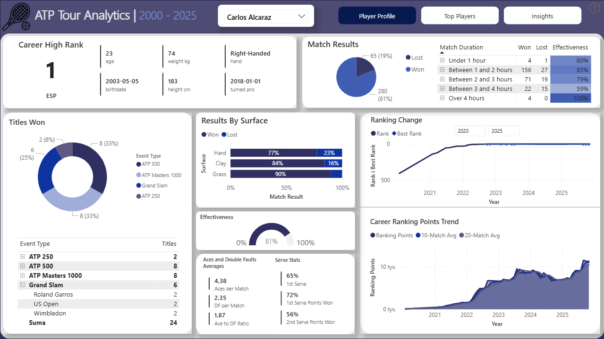
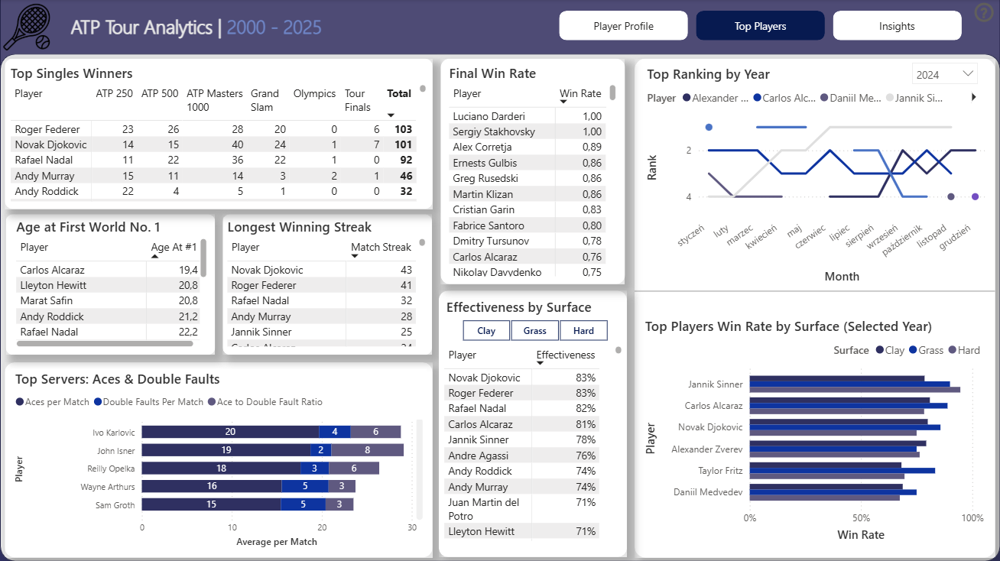
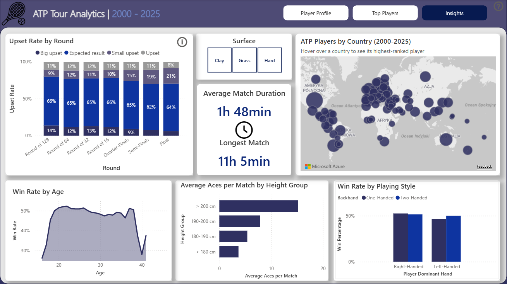

# ATP Tour Analytics | 2000–2025

## Project Goal

The goal of this project is to analyze ATP match data to better understand player performance, career progression, and match dynamics. It focuses on identifying trends across surfaces, playing styles, and match conditions, and translating raw data into insights useful for tennis enthusiasts, analysts, or coaching staff.

An end-to-end data analytics project built on ATP Tour match data from 2000 to 2025. The dashboard was designed from the perspective of a tennis enthusiast or coaching staff — providing tools to analyze player performance, track career trends, and identify patterns across surfaces and playing styles.

---

## Data Source

Raw data sourced from [TML Database](https://github.com/Tennismylife/TML-Database) — a complete, live-updated database of ATP tournaments and matches, originally inspired by Jeff Sackmann's tennis_atp repository.

---

## Project Architecture

The project follows a **medallion architecture** with three layers:

```
Raw CSV files
      │
      ▼
  📁 Bronze        ← raw data, no transformations
      │
      ▼
  📁 Silver        ← cleaning, standardization, filtering
      │
      ▼
  📁 Gold          ← star schema, ready for Power BI
```

### Bronze
Raw data loaded as-is from CSV files into SQL Server. No transformations applied - this layer preserves the original source data.

### Silver
Data cleaning and standardization layer. Key transformations include:
- Trimming whitespace and standardizing text fields
- Fixing data entry errors (e.g. birthdates loaded into weight column)
- Handling nulls with `COALESCE` and setting valid value ranges for height and weight
- Standardizing categorical fields (hand, backhand, surface) using `CASE WHEN`
- Deduplicating matches (Davis Cup recorded under multiple IDs, round number conflicts)
- Manual fixes for known data issues (duplicate player IDs, incorrect IOC codes)
- Filtering out players with no match records

### Gold
Business-ready layer optimized for Power BI reporting:

| Table | Description |
|-------|-------------|
| `dim_players` | Player profiles — name, nationality, height, weight, hand, backhand, birthdate |
| `dim_tournaments` | Tournament details — name, surface, level (Grand Slam, Masters, etc.), indoor flag |
| `fact_match` | One row per match — winner/loser IDs, score, duration, round, upset flag |
| `fact_match_player_stats` | One row per player per match — ranking, rank points, serve stats, break points |

Additional analytical views:

| View | Description |
|------|-------------|
| `win_streak` | Consecutive win/loss streaks per player |
| `player_ranking_trend` | Ranking points with 10 and 20-match moving averages |
| `player_aces_trend` | Aces per match trend with 10-match moving average |

---

## Technologies

- **SQL Server** - data storage, cleaning, and modeling
- **Power BI Desktop** - dashboard and visualizations
- **DAX** - measures and calculated columns in Power BI

---

## Key SQL Techniques

- **CTEs** - used throughout silver and gold layers for readable, modular queries
- **Window functions** — `ROW_NUMBER()` for deduplication, streak detection and match sequencing, `AVG() OVER()` for moving averages
- **`CASE WHEN`** - data standardization, bucketing (duration categories, upset categories, height groups)
- **`UNION ALL`** - combining winner and loser perspectives into a single player-level stats table
- **`CAST`, `TRIM`, `COALESCE`** - data type corrections and null handling in silver layer
- **Aggregate functions** - `MIN`, `MAX`, `COUNT`, `SUM` across multiple grouping levels

---

## DAX Highlights
Key measures implemented in Power BI:
- Win rate, first serve %, second serve %, break points saved rate
- Ace to double fault ratio
- Age at first World No. 1 using `MINX` and `FILTER`
- `COALESCE` used throughout to replace BLANK with 0

--- 

## Data Quality
Quality checks were performed at each layer (bronze, silver, gold) to validate row counts, identify outliers, verify referential integrity, and document known data issues before applying fixes in silver.

---

## Dashboard Overview

Download `powerbi/atp_tour_analytics.pbix` and open in Power BI Desktop.
No database connection required — data is embedded in the file.

---

### Player Profile


A detailed view of an individual player's career, filterable by name. Includes:
- Career high rank, age, weight, height, hand, backhand, nationality, turned pro date
- Match results - won/lost ratio and effectiveness by match duration
- Titles won by tournament type with drill-down to specific tournament names
- Results by surface
- Serve statistics - aces per match, double faults, ace-to-DF ratio, 1st serve %, 1st serve points won %, 2nd serve points won %
- Career Ranking Points Trend with 10-match and 20-match moving averages

### Top Players


Comparative analysis of the best players in the dataset:
- Total titles by tournament type
- Age at first World No. 1
- Longest winning streak
- Top servers - aces, double faults, ace-to-DF ratio
- Final win rate and effectiveness by surface
- Top ranking by year and win rate by surface for selected year

### Insights


Exploratory analysis and pattern discovery:
- Upset rate by round
- Win rate by age
- Average and longest match duration
- Count of ATP players by country with highest-ever ranking on hover
- Average aces per match by height group
- Win rate by playing style - hand and backhand type

---

## Reproducing the Data Pipeline
To rebuild the data warehouse from scratch:
1. Download raw CSV files from [TML Database](https://github.com/Tennismylife/TML-Database)
	* ATP match data (2000–2025) — yearly CSV files (`YYYY.csv`)
	* Player data — `ATP_Database.csv`
2. Update file paths in `sql/bronze/02_load_bronze_layer.sql` to match your local machine
3. Run SQL scripts in the following order:

```
   - sql/00_init.sql    → create database and schemas
   - sql/bronze/        → create tables and load raw CSV data
   - sql/silver/        → run stored procedures for players and matches
   - sql/gold/          → run fact and dimension scripts first, then analytical views
```
(Optional) Run validation scripts in each layer to verify data quality.

4. Open `.pbix` file and update data source connection to your local SQL Server instance

---

## Notes

- Walkovers (`W/O`) and retired matches (`RET`) are flagged in `match_status` and excluded from duration and streak analysis where appropriate
- Ranking data is only available at match level (not weekly), which creates gaps for players who did not compete in a given month - moving averages are used to smooth trends
- Win rate by age analysis is subject to **survivorship bias** at older ages - only elite players continue competing past 33, which inflates win rates for those age groups
